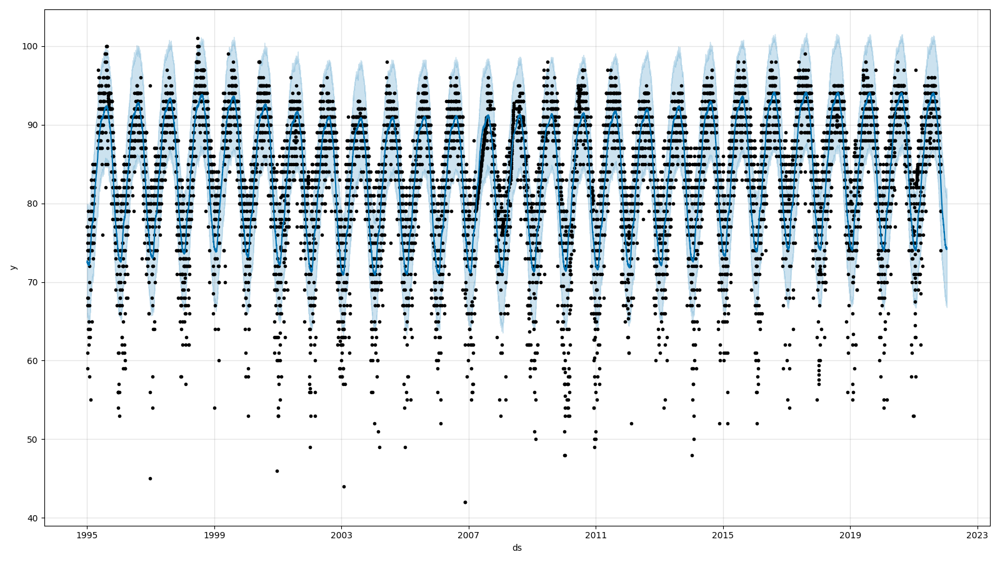
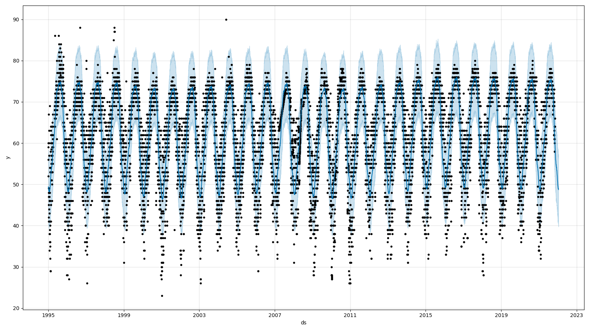

# disney-marathon-weather

## Estimated High Temps

```bash
disney-marathon-weather-terminal-1  |             ***** Anticipated Max Temps *****            
disney-marathon-weather-terminal-1  |              ds     y  yhat_lower       yhat  yhat_upper
disney-marathon-weather-terminal-1  | 7    1995-01-08  59.0   65.656943  72.451986   79.935027
disney-marathon-weather-terminal-1  | 341  1996-01-07  70.0   65.854108  72.920760   79.810529
disney-marathon-weather-terminal-1  | 705  1997-01-05  82.0   66.701798  73.421034   79.942856
disney-marathon-weather-terminal-1  | 1076 1998-01-11  73.0   66.427637  73.862510   80.806478
disney-marathon-weather-terminal-1  | 1440 1999-01-10  79.0   67.103667  74.131287   81.352178
disney-marathon-weather-terminal-1  | 1773 2000-01-09  81.0   67.031892  73.510655   80.778277
disney-marathon-weather-terminal-1  | 2137 2001-01-07  68.0   65.198459  72.548392   79.308832
disney-marathon-weather-terminal-1  | 2501 2002-01-06  64.0   64.502711  71.713771   78.471943
disney-marathon-weather-terminal-1  | 2872 2003-01-12  66.0   63.661345  71.183312   77.927425
disney-marathon-weather-terminal-1  | 3236 2004-01-11  52.0   63.800022  71.189684   78.429256
disney-marathon-weather-terminal-1  | 3600 2005-01-09  80.0   64.475676  71.296093   77.872715
disney-marathon-weather-terminal-1  | 3964 2006-01-08  56.0   64.272747  71.403365   78.720470
disney-marathon-weather-terminal-1  | 4328 2007-01-07  83.0   64.915213  71.512267   78.337932
disney-marathon-weather-terminal-1  | 4699 2008-01-13  79.5   64.733272  71.484221   77.880411
disney-marathon-weather-terminal-1  | 5033 2009-01-11  76.0   65.208946  71.589872   78.384560
disney-marathon-weather-terminal-1  | 5366 2010-01-10  57.0   64.845305  71.695186   78.544567
disney-marathon-weather-terminal-1  | 5730 2011-01-09  71.0   64.874610  71.903537   79.104412
disney-marathon-weather-terminal-1  | 6081 2012-01-08  74.0   64.844000  72.180426   78.897077
disney-marathon-weather-terminal-1  | 6438 2013-01-13  82.0   65.476578  72.331998   79.398612
disney-marathon-weather-terminal-1  | 6802 2014-01-12  85.0   66.149852  72.844556   79.748073
disney-marathon-weather-terminal-1  | 7159 2015-01-11  69.0   66.758982  73.500295   81.058955
disney-marathon-weather-terminal-1  | 7504 2016-01-10  74.0   66.970336  74.155959   81.411544
disney-marathon-weather-terminal-1  | 7849 2017-01-08  75.0   67.256195  74.440164   81.531875
disney-marathon-weather-terminal-1  | 8193 2018-01-07  57.0   67.150349  74.447053   81.653200
disney-marathon-weather-terminal-1  | 8560 2019-01-13  80.0   67.667900  74.316570   81.556741
disney-marathon-weather-terminal-1  | 8917 2020-01-12  83.0   66.776717  74.321438   81.240758
disney-marathon-weather-terminal-1  | 9271 2021-01-10  73.5   67.957679  74.325886   81.421582
disney-marathon-weather-terminal-1  | 9632 2022-01-09   NaN   67.493077  74.330483   81.774377
```
## Estimated Low Temps

```bash
disney-marathon-weather-terminal-1  |             ***** Anticipated Min Temps *****            
disney-marathon-weather-terminal-1  |              ds     y  yhat_lower       yhat  yhat_upper
disney-marathon-weather-terminal-1  | 7    1995-01-08  47.0   39.826614  48.592620   57.162434
disney-marathon-weather-terminal-1  | 341  1996-01-07  53.0   40.191461  48.659567   57.774238
disney-marathon-weather-terminal-1  | 705  1997-01-05  52.0   40.180726  48.743370   57.057991
disney-marathon-weather-terminal-1  | 1076 1998-01-11  47.0   40.234264  48.305363   56.379469
disney-marathon-weather-terminal-1  | 1440 1999-01-10  52.0   39.719854  47.975962   56.366164
disney-marathon-weather-terminal-1  | 1773 2000-01-09  56.0   39.507532  47.406895   55.959416
disney-marathon-weather-terminal-1  | 2137 2001-01-07  29.0   38.182378  46.849089   55.551087
disney-marathon-weather-terminal-1  | 2501 2002-01-06  34.0   38.586639  47.229023   55.759144
disney-marathon-weather-terminal-1  | 2872 2003-01-12  44.0   39.532401  47.158818   55.661732
disney-marathon-weather-terminal-1  | 3236 2004-01-11  39.0   39.239049  47.502219   55.506675
disney-marathon-weather-terminal-1  | 3600 2005-01-09  57.0   39.410632  47.857332   56.456553
disney-marathon-weather-terminal-1  | 3964 2006-01-08  34.0   39.787065  48.190920   56.488606
disney-marathon-weather-terminal-1  | 4328 2007-01-07  66.0   39.994347  48.424075   56.918521
disney-marathon-weather-terminal-1  | 4699 2008-01-13  56.5   38.880241  47.705640   55.486988
disney-marathon-weather-terminal-1  | 5033 2009-01-11  49.0   38.759953  47.211934   55.850085
disney-marathon-weather-terminal-1  | 5366 2010-01-10  27.5   38.603068  46.843754   54.705029
disney-marathon-weather-terminal-1  | 5730 2011-01-09  39.0   38.630748  46.957810   54.662883
disney-marathon-weather-terminal-1  | 6081 2012-01-08  44.0   39.605372  47.554372   56.041750
disney-marathon-weather-terminal-1  | 6438 2013-01-13  59.0   39.557105  47.864344   56.323014
disney-marathon-weather-terminal-1  | 6802 2014-01-12  61.0   40.496433  48.497923   56.967058
disney-marathon-weather-terminal-1  | 7159 2015-01-11  50.0   40.661522  49.141698   57.510088
disney-marathon-weather-terminal-1  | 7504 2016-01-10  59.0   41.314172  49.534275   57.791774
disney-marathon-weather-terminal-1  | 7849 2017-01-08  36.0   40.783203  49.563039   57.330171
disney-marathon-weather-terminal-1  | 8193 2018-01-07  33.0   40.524371  49.553921   57.605189
disney-marathon-weather-terminal-1  | 8560 2019-01-13  44.0   40.848359  49.134569   57.697176
disney-marathon-weather-terminal-1  | 8917 2020-01-12  56.5   40.331529  49.079153   57.238955
disney-marathon-weather-terminal-1  | 9271 2021-01-10  38.0   40.297488  49.034531   57.503501
disney-marathon-weather-terminal-1  | 9632 2022-01-09   NaN   40.763844  49.002286   57.346125
```